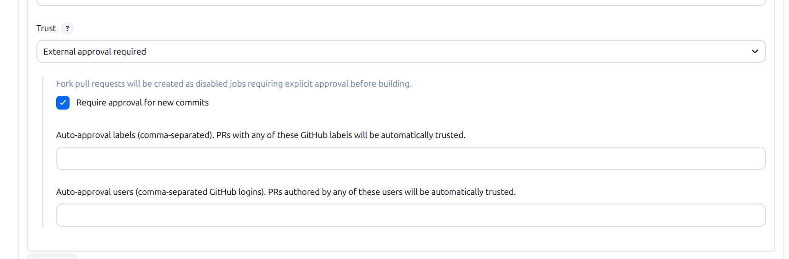
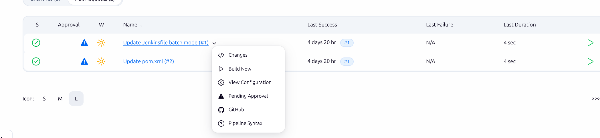
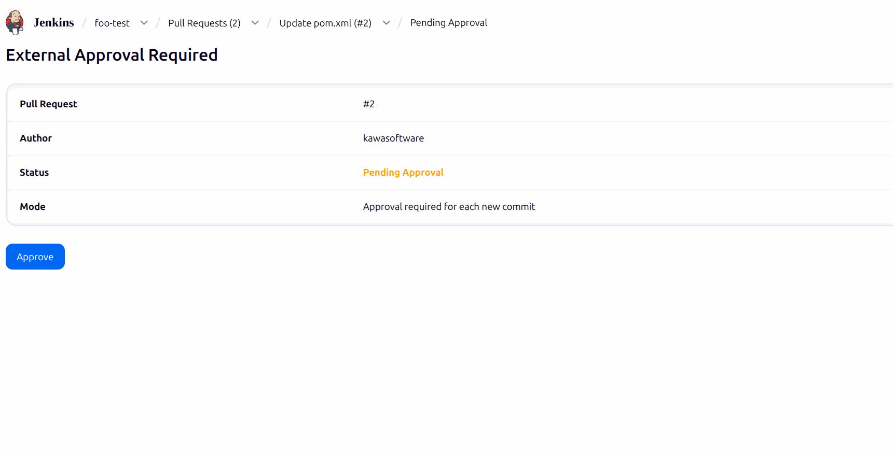

# GitHub PR Approval Plugin

Adds an **External approval required** trust policy for GitHub fork pull requests.

With the [GitHub Branch Source plugin](https://github.com/jenkinsci/github-branch-source-plugin),
trusting fork PRs is all-or-nothing (nobody, everybody, contributors, or write access). This plugin
adds a middle ground: fork PRs are discovered as usual, but each one waits for a person to approve
it before it builds. Handy for public repos where you want CI on fork PRs, but only after someone
has taken a look.

Requires the GitHub Branch Source plugin and a multibranch project.

## Setting it up

In your multibranch project, under *Discover pull requests from forks*, set **Trust** to
**External approval required**:

### Options

- **Require approval for new commits** — the approval only covers the commit you approved. When a new
  commit is pushed, the next build needs a fresh approval.
- **Auto-approval users** — GitHub logins (comma-separated) whose PRs are approved automatically.
  Matched ignoring case, like GitHub does. These authors never have to ask again.
- **Auto-approval labels** — labels (comma-separated) that approve a PR automatically. Checked once,
  when the PR is first seen.

## How it works

A new fork PR is discovered like any other, but its job is created disabled and carries a
**Pending Approval** action:

Open **Pending Approval** to see who opened the PR, which commit is up for approval, and the
**Approve** button. Anyone with `Configure` permission on the job can use it:

Approving enables the job and starts a build. Once approved, the same page offers
**Revoke Approval** to take it back. The approval is saved next to the job, so it sticks across
restarts.

An unapproved PR is blocked wherever the build comes from — a scan, a webhook, or someone pressing
*Build Now*.

## Managing approvals over MCP

If the [MCP Server plugin](https://github.com/jenkinsci/mcp-server-plugin) is installed, this plugin
adds two MCP tools so an assistant can find and approve pending fork PRs without opening Jenkins. They
run as the connecting user and enforce the same permissions as the UI. If that plugin is not
installed, the tools simply aren't there and everything else works as normal.

- **`getPendingApprovals`** — lists the fork PRs currently blocked waiting for approval. Pass an
  optional `jobName` (a multibranch project's full name, e.g. `my-org-repo`) to limit the list to
  that one project; omit it to scan them all. Each entry gives the branch job's full name and URL,
  the PR number and author, the commit awaiting approval, and whether new commits need re-approval.
- **`approvePullRequest`** — approves one blocked PR so it builds. Takes the branch job's full name
  (e.g. `my-org-repo/PR-42`) and an optional `addAuthorToAutoApprovalUsers` flag that also adds the
  PR author to the policy's *Auto-approval users*, so their future PRs build without asking.

Approving needs `Configure` on the job; adding an author to the auto-approval list also needs
`Configure` on the multibranch project.

## Contributing

Build and test instructions, the code layout, and the release setup are in
[CLAUDE.md](CLAUDE.md).

## License

MIT — see [LICENSE.txt](LICENSE.txt).
